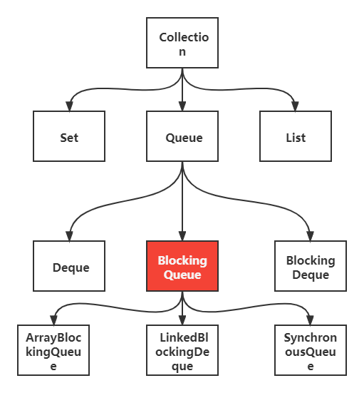
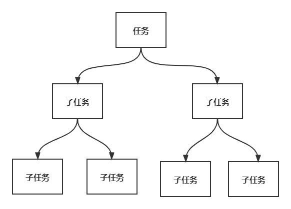
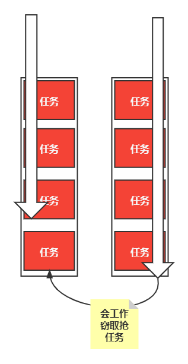
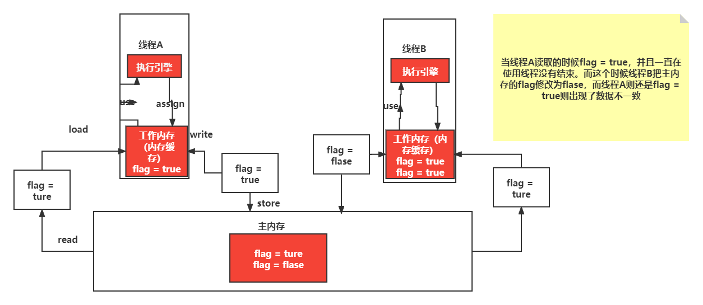

# 1、什么是JUC

1. JUC是java.util.concurrent的简写，是java并发编程工具包
2. java实现多线程有三种方式：Thread、Runnable、Callable、其中Callable位于concurrent包下。
2. juc下有三个接口：Lock、Condition、ReadWriteLock

# 2、线程和进程

1. 一个进程包括多个线程。
2. 一个线程只属于一个进程。
3. java默认线程有两个是main方法和GC

# 3、线程

## 1、线程状态

new（新生）、runnable（运行）、blocked（阻塞）、waiting（等待）、timed_waiting（超时等待）、terminated（终止）

## 2、wait和sleep区别

1. wait来自Object类，sleep来自Thread类。
2. wait会释放同步锁，sleep不会释放同步锁。
3. wait必须在同步代码块中使用，sleep可以在任何地方使用。
4. sleep可以使用指定时间来使他自动醒来，如果时间不到只能调用interreput()来强行打断。wait()可以使用notify()直接唤起。

# 4、并行和并发

1. 并发：多线程操作同一个资源，多个事件在同一时刻间隔发生
2. 并行：多个事件在同一时刻发生，并排走，多台处理器同时处理多个任务。

# 5、Lock

> 1. java.util.concureent.locks.Lock
> 2. 有三个实现类：ReentrantLock(重复锁)、ReentrantReadWriteLock.ReadLock(读锁)、ReentrantReadWriteLock.WriteLock(写锁)

## 1、ReentrantLock

1. 有两个锁，公平锁和非公平锁，公平锁必须排队，非公平锁可以插队（默认），有参构造如果为true则为公平锁。

2. 使用：

   - ```java
     class X { private final ReentrantLock lock = new ReentrantLock(); // ... public void m() { lock.lock(); // block until condition holds try { // ... method body } finally { lock.unlock() } } } 
     ```

   * ```java
     class Tick2 {
         private int ticks = 50;
         Lock lock = new ReentrantLock();
         public void saleTick() {
             lock.lock();
             try {
                 if (ticks > 0) {
                     System.out.println(Thread.currentThread().getName() + "卖出了一张票" + " 剩余：" + --ticks+" 张票");
                 }
             }catch (Exception e) {
                 e.printStackTrace();
             }finally {
                 lock.unlock();
             }
     
         }
     }
     ```

## 2、Lock锁和Synchronized区别

1. 重要：Lock锁支持非阻塞的获取锁，而Synchronized则会阻塞。

1. Synchronized是java内置的关键字，Lock是java的类。
2. Lock比Synchronized更灵活。
3. Synchronized无法判断获取锁的状态，Lock可以判断是否获取到了锁。
4. Synchronized会自动释放锁，Lock则必须自己手动释放锁，如果不释放锁，则会一直执行第一个线程，死锁。
5. Synchronized如果线程获得锁并且阻塞了，则下一个线程会一直等待，Lock就不一定会等待下去，可以使用`tryLock()` 方法。
6. Synchronized可重入锁，不可用中断属于非公平锁。Lock，可重入锁，可以判断锁，公平锁和非公平锁可以自己设置。
7. Synchronized适合锁少量的代码同步问题，Lock适合锁大量的同步代码。
8. Lock实现提供比使用synchronized方法和语句可以获得更广泛的锁定操作。他们允许更灵活的结构化，可能具有完全不用的属性，并且可以支持多个相关联的对象Condition。
9. Lock中有些锁可以允许并发访问共享资源，如ReadWriteLock的读锁。
10. Lock锁可以更灵活的方式处理锁，例如，用于遍历并发访问的数据结构的一些算法，并允许获得多个锁使得能够使用这样的技术

# 6、生产者和消费者

## 1、Synchronized版

```java
public class SynchronizedDemo {
    public static void main(String[] args) {
        Factory factory = new Factory();
        new Thread(() -> {
            for (int i = 0; i < 10; i++) {
                try {
                    factory.product();
                } catch (InterruptedException e) {
                    e.printStackTrace();
                }
            }
        }, "A工厂").start();
        new Thread(() -> {
            for (int i = 0; i < 10; i++) {
                try {
                    factory.consume();
                } catch (InterruptedException e) {
                    e.printStackTrace();
                }
            }
        }, "A消费者").start();
    }
}
class Factory {
    private int number = 0;
    public synchronized void product() throws InterruptedException {
        while (number != 0) {
            this.wait();
        }
        System.out.println(Thread.currentThread().getName() + "生产了：" + ++number + "个票");
        this.notify();
    }
    public synchronized void consume() throws InterruptedException {
        while (number == 0) {
            this.wait();
        }
        System.out.println(Thread.currentThread().getName() + "消费了： " + --number + "个票");
        this.notify();
    }
}
```

## 2、虚假唤醒

如果wait()用if判断的话，因为if只会判断一次，判断完就结束了，可能会产生虚假唤醒，所以建议使用while循环进行判断不会出问题。

## 3、Lock版

1. JUC有一个Condition监视器，有三个方法类似Synchronized的wait和notify方法。await和signal(signalAll)

2. 使用

   ```java
   public class LockDemo {
       public static void main(String[] args) {
           FactoryLock factoryLock = new FactoryLock();
           new Thread(() -&gt; {
               for (int i = 0; i &lt; 20; i++) {
                   factoryLock.produce();
               }
           },&quot;A工厂&quot;).start();
           new Thread(() -&gt; {
               for (int i = 0; i &lt; 20; i++) {
                   factoryLock.consume();
               }
           },&quot;B消费者&quot;).start();
           new Thread(() -&gt; {
               for (int i = 0; i &lt; 20; i++) {
                   factoryLock.consume();
               }
           },&quot;C消费者&quot;).start();
           new Thread(() -&gt; {
               for (int i = 0; i &lt; 20; i++) {
                   factoryLock.consume();
               }
           },&quot;D消费者&quot;).start();
       }
   }
   class FactoryLock {
       private int number = 0;
       final Lock lock = new ReentrantLock();
       final Condition condition = lock.newCondition();
       public void produce() {
           lock.lock();
           try {
               while (number != 0) {
                   condition.await();
               }
               condition.signalAll();
               System.out.println(Thread.currentThread().getName() + &quot;生产了：&quot; + ++number + &quot;个票&quot;);
           }catch (Exception e) {
               e.printStackTrace();
           }finally {
               lock.unlock();
           }
       }
       public void consume() {
           lock.lock();
           try {
               while (number == 0) {
                   condition.await();
               }
               condition.signalAll();
               System.out.println(Thread.currentThread().getName() + &quot;消费了： &quot; + --number + &quot;个票&quot;);
           }catch (Exception e) {
               e.printStackTrace();
           }finally {
               lock.unlock();
           }
       }
   }
   ```

## 4、同步队列（SynchronousQueue）版

```java
public class SynchronousQueueTest {
    public static void main(String[] args) throws InterruptedException {
        SynchronousQueue<Integer> queue = new SynchronousQueue<>();
        new Thread(() -> {
            for (int i = 0; i < 4; i++) {
                System.out.println(Thread.currentThread().getName() + "需要一把牙刷");
                try {
                    System.out.println(Thread.currentThread().getName() + "买了一把id为" + queue.take() + "的牙刷");
                } catch (InterruptedException e) {
                    e.printStackTrace();
                }
            }
        }, "消费者").start();
        TimeUnit.SECONDS.sleep(2);
        new Thread(() -> {
            for (int i = 0; i < 4; i++) {
                try {
                    queue.put(i);
                    System.out.println(Thread.currentThread().getName() + "生产了id为"+i+"把牙刷");
                } catch (InterruptedException e) {
                    e.printStackTrace();
                }
            }
        }, "生产者").start();
    }
}
```

## 5、按指定顺序执行线程

> 利用多个监视器Condition来具体await()和signal()

1. 使用

   ```java
   public class Controller_Lock_Order {
       public static void main(String[] args) {
           Data data = new Data();
           new Thread(() -> {
               for (int i = 0; i < 10; i++) {
                   data.theadA();
               }
           },"A").start();
           new Thread(() -> {
               for (int i = 0; i < 20; i++) {
                   data.theadB();
               }
           },"B").start();
           new Thread(() -> {
               for (int i = 0; i < 20; i++) {
                   data.theadC();
               }
           },"C").start();
       }
   }
   class Data {
       final Lock lock = new ReentrantLock();
       Condition condition1 = lock.newCondition();
       Condition condition2 = lock.newCondition();
       Condition condition3 = lock.newCondition();
       private String id = "A";
       public void theadA() {
           lock.lock();
           try {
               while (!id.equals("A")) {
                   condition1.await();
               }
               System.out.println(Thread.currentThread().getName()+"调用了AAAA");
               id = "B";
               condition2.signal();
           } catch (Exception e) {
               e.printStackTrace();
           } finally {
               lock.unlock();
           }
       }
       public void theadB() {
           lock.lock();
           try {
               while (!id.equals("B")) {
                   condition2.await();
               }
               System.out.println(Thread.currentThread().getName()+"调用了BBBB");
               id = "C";
               condition3.signal();
           } catch (Exception e) {
               e.printStackTrace();
           } finally {
               lock.unlock();
           }
       }
       public void theadC() {
           lock.lock();
           try {
               while (!id.equals("C")) {
                   condition3.await();
               }
               System.out.println(Thread.currentThread().getName()+"调用了CCCC");
               id = "A";
               condition1.signal();
           } catch (Exception e) {
               e.printStackTrace();
           } finally {
               lock.unlock();
           }
       }
   }
   ```

# 7、八锁

## 1、八锁测试

https://gitee.com/tuzhilv/juc-study/tree/master/juc/src/main/java/com/tuzhi/lock8

## 2、小结

1. 没加static new出来的锁的是当前对象。
2. 加static的锁的是class。

# 8、高并发下集合类不安全

> 如果在高并发下使用集合类会报错ConcurrentModificationException

## 1、List

### 1、解决办法

1. List list = new Vector();(这个方法是add类加了关键字Synchronized)
2. List list = Collections.synchronizedList(new ArrayList());(这个方法里面是加了Synchronized块)
3. List list = CopyOnWriteArrayList();()这个add方法是用Lock锁的默认锁非公平锁

### 2、使用

1. 在高并发下应该使用CopyOnWriteArrayList()。
2. CopyOnWirteArrayList底层源码实现是用Lock锁，前两个解决方法的底层源码实现是用Synchronized关键字，Lock锁默认用的是非公平锁，效率比Synchronized高。

## 2、Set

### 1.解决办法

1. Set set = Collections.synchronizedSet(new HashSet())：使用工具类：这个add方法里面是加了Synchronized块。
2. Set set = CopyOnWriteArraySet()：这个add方法是用Lock锁的默认锁非公平锁。

### 2、使用

1. 在高并发下应该使用CopyOnWriteArraySet()。
2. CopyOnWriteArraySet()底层源码实现是用Lock锁，前两个解决方法的底层源码实现是用Synchronized关键字，Lock锁默认用的是非公平锁，效率比Synchronized高。

## 3、Map

### 1、解决办法

1. Map map = Collections.synchronizedMap(new HashMap())
2. Map map = new ConcureentHashMap()：这个add方法是用Lock锁的默认锁非公平锁。

## 2、ConcurrentHashMap类原理

1. 支持检索的完全并发性和更新的高预期并发性的哈希表。这个类服从相同功能规范如Hashtable，并且包括对应于每个方法版本Hashtable。不过，尽管所有操作都是线程安全的，检索操作并不意味着锁定，并没有为防止所有访问的方式锁定整个表的任何支持。这个类可以在依赖于线程安全性的程序中与Hashtable完全互HashTable，但不依赖于其同步细节。
2. 检索操作（包括get）通常不阻止，因此可能与更新操作重叠（包括put和remove)。检索反映了最近完成的更新操作的结果，（更正式的，对于给定密钥的更新操作之前发生与任何（非空关系检索该键报告更新的值））对于聚合操作，比如putAll和clear，并发检索可能反映插入或移除1只有一些条目。类似低，迭代器，分割器和枚举返回在反映迭代器/枚举创建过程中或之后反映哈希表状态的元素。他们不抛出ConcurrentModificationException。然而，迭代器被设计为一次只能由一个线程使用。

### 3、Hashtable

1. 该类实现类一个哈希表，它将键映射到值。任何非null对象都可以用作键值或值。
2. Hashtable一个实例有两个影响其性能的参数：初始容量和负载因子。
3. 通常负载因子（0.75f）提供了时间和空间成本之间的良好折中。更高的值会减少空间开销，但会增加查询条目的时间成本（这反映在大多数Hashtable操作中，包括get和put）。

# 9、Callable

> 1. Callable接口类似于Runnable，因为它们都是为其实例肯呢个由另一个线程类执行的类设计的。然而，Runnable不返回结果，也不能抛出异常，而Callable可以。
> 2. Callable还具有缓存。

## 1、使用

```java
public class CallableTest {
    public static void main(String[] args) throws ExecutionException, InterruptedException {
        FutureTask futureTask = new FutureTask(new MyThread());
        new Thread(futureTask,"A") .start();
        new Thread(futureTask,"B") .start();
        System.out.println(futureTask.get());
    }
}
class MyThread implements Callable<String> {
    @Override
    public String call() throws Exception {
        System.out.println("call()执行了");
        return "我结束了";
    }
}
```

# 10、常用的辅助类（重要）

## 1、CountDownLatch

### 1、CountDownLatch是什么

1. 允许一个或多个线程等到直到在其他线程中执行的一组操作完成的同步辅助。

2. CountDownLatch用给定的计数初始化，await方法阻塞，直到用countDown()方法的调用而导致当前计数达到零，之后所有等待线程被释放，并且任何后续的await调用立即返回。

3. CountDownLatch是一种通用的同步工具，可用于多种用途。一个CountDownLatch为一个计数的CountDownLatch用作一个简单的开/关锁存器，或者门：所有线程调用await在门口等待，直到被调用countDwoen()的线程打开。
4. CountDownLatch一个有用的属性是，它不要求调用countDown线程等待计数到达零之前继续，它只是阻止任何线程通过await，直到所有线程可以通过。

### 2、使用

```java
public class CountDownLatchTest {
    public static void main(String[] args) throws InterruptedException {
//        初始化计数6
        CountDownLatch countDownLatch = new CountDownLatch(6);
        for (int i = 0; i < 6; i++) {
            new Thread(() -> {
                System.out.println(Thread.currentThread().getName() + "出去了");
//                计数减一
                countDownLatch.countDown();
            },String.valueOf(i)).start();
        }
//        阻塞，只有计数为0时才可以执行await后面的代码
        countDownLatch.await();
        System.out.println("都出去了");
    }
}
```

## 2、CyclicBarrier

### 1、CyclicBarrier

1. 当等待的线程到达规定数量的时候执行某一个线程。

### 2、使用

```java
public class CyclicBarrierTest {
    public static void main(String[] args){
//        可以传入一个数值和一个线程
        CyclicBarrier cyclicBarrier = new CyclicBarrier(4,new Thread(() -> {
            System.out.println("符合条件，我被执行了");
        }));
        for (int i = 0; i < 10; i++) {
            new Thread(() -> {
                System.out.println(Thread.currentThread().getName() + "执行了");
                try {
//                    当等待的线程到达规定数量的时候执行某一个线程。
                    cyclicBarrier.await();
                } catch (InterruptedException e) {
                    e.printStackTrace();
                } catch (BrokenBarrierException e) {
                    e.printStackTrace();
                }
            },String.valueOf(i)).start();
        }
    }
}
```

## 3、Semaphore

## 1、什么是Semaphore

> 可用作限流等。

1. 一个计数信号量。在概念上，信号量维持一组许可证。如果有必要，每个acquire()都会阻塞，直到许可证被释放可以被其他人用。每个release()释放许可证，潜在地释放阻塞获取方。Semaphone只保留可用数量的计数，并相应地执行，
2. 信号量通常用于限制线程数，而不是访问某些（物理或逻辑）资源。例如，这是一个使用信号量来控制对一个项目池的访问类。
3. 常用的两个方法：
   * acquire()：获取许可证，如果可以获取许可证就可以执行之后的代码
   * release()：释放许可证

### 2、使用

```java
public class SemaphoreTest {
    public static void main(String[] args) {
//        可以初始化许可证数量，当到达许可证数量的时候，则停止
        Semaphore semaphore = new Semaphore(3);
        for (int i = 0; i < 6; i++) {
            new Thread(() -> {
                try {
                    semaphore.acquire();
                    System.out.println(Thread.currentThread().getName() + "获得许可证");
                    //获取许可证
                    TimeUnit.SECONDS.sleep(2);
                    System.out.println(Thread.currentThread().getName() + "释放许可证");
                } catch (InterruptedException e) {
                    e.printStackTrace();
                }finally {
//                   2秒后释放许可证
                    semaphore.release();
                }
            }, String.valueOf(i)).start();
        }
    }
}
```

# 11、ReadWriteLock

## 1、什么是ReadWriteLock

1. ReadWriteLock是一对关联的的locks，一个用于只读操作，一个用于写入，read lock可以由多个线程同时进行，而write lock只能一个线程进行。
2. 有两个方法:
   * readLock()：读锁，共享锁，可以多个线程一起读。
   * writeLock()：写锁，排他锁，独占锁，只能一个线程写。

## 2、使用

```java
public class ReadWriteLockTest {
    public static void main(String[] args) {
        Data data = new Data();
        for (int i = 0; i < 6; i++) {
            int finalI = i;
            new Thread(() -> {
                data.write(finalI, finalI);
            }, String.valueOf(i)).start();
        }
        for (int i = 0; i < 6; i++) {
            int finalI = i;
            new Thread(() -> {
                data.read(finalI);
            }, String.valueOf(i)).start();
        }

    }
}
class Data {
    Map hash = new HashMap<Integer,Integer>();
    ReadWriteLock readWriteLock = new ReentrantReadWriteLock();

    public void write(Integer k, Integer v) {
        readWriteLock.writeLock().lock();
        try {
            System.out.println(Thread.currentThread().getName() + "开始写");
            hash.put(k,v);
            System.out.println(Thread.currentThread().getName() + "写结束");
        } catch (Exception e) {
            e.printStackTrace();
        } finally {
            readWriteLock.writeLock().unlock();
        }
    }
    public void read(Integer k) {
        readWriteLock.readLock().lock();
        try {
            System.out.println(Thread.currentThread().getName() + "开始读");
            Object o = hash.get(k);
            System.out.println(Thread.currentThread().getName() + "读到的是： " + o);
        } catch (Exception e) {
            e.printStackTrace();
        } finally {
            readWriteLock.readLock().unlock();
        }
    }
}
```

# 12、阻塞队列

> 1. new对象的时候可以传入一个参数来初始化阻塞队列大小。
> 2. 写入：如果队列满了，就必须阻塞等待。
> 3. 取：如果是队列是空的，必须阻塞等待生产。

## 1、什么是阻塞队列

1. 

2. BlockingQueue实现被设计为主要用于生产者-消费者队列，多线程并发处理，线程池，但另外支持Collection接口。
3. BlockingQueue实现是线程安全的，所有排队方法使用内部锁或其他形式的并发控制在原子上实现其效果，然而，大量的Collection操作addAll，containAll,retainAll和removeAll不一定原子除非排除在实现中另有规定执行。因此有可能，例如，为addAll(c)到只增加一些元件在后失败抛出异常。

## 2、四组API（重要)

> 实现 BlockingQueue的类都拥有这四阻Api

| 方式         | 抛出异常  | 有返回值，不抛出异常 | 阻塞   | 超时结束                                |
| ------------ | --------- | -------------------- | ------ | --------------------------------------- |
| 添加         | add()     | offer()              | put()  | offer(E e, long timeout, TimeUnit unit) |
| 移除         | remove()  | poll()               | take() | poll(long timeout, TimeUnit unit)       |
| 检测队首元素 | element() | peek()               |        |                                         |

## 3、同步队列

### 1、什么是同步队列

1. 类SynchronousQueue。
2. 属于BlockingQueue接口。
3. SynchronousQueue没有容量大小，甚至没有一个容量。其中每个插入操作必须等待另一个线程相应的删除操作，反之亦然。你不能`peek`在同步队列，因为一个元素，当您尝试删除它才存在;  您无法插入元素（使用任何方法），除非另有线程正在尝试删除它; 你不能迭代，因为没有什么可以迭代。  队列的*头部*是第一个排队的插入线程尝试添加到队列中的元素;  如果没有这样排队的线程，那么没有元素可用于删除，并且`poll()`将返回`null` 。 
4. 此类支持可选的公平策略，用于订购等待的生产者和消费者线程。默认情况下，此订单不能保证。然而，以公平设置为`true`的队列以FIFO顺序授予线程访问权限。

### 2、使用

```java
public class SynchronousQueueTest {
    public static void main(String[] args) throws InterruptedException {
        SynchronousQueue<Integer> queue = new SynchronousQueue<>();
        new Thread(() -> {
            for (int i = 0; i < 4; i++) {
                System.out.println(Thread.currentThread().getName() + "需要一把牙刷");
                try {
                    System.out.println(Thread.currentThread().getName() + "买了一把id为" + queue.take() + "的牙刷");
                } catch (InterruptedException e) {
                    e.printStackTrace();
                }
            }
        }, "消费者").start();
        TimeUnit.SECONDS.sleep(2);
        new Thread(() -> {
            for (int i = 0; i < 4; i++) {
                try {
                    queue.put(i);
                    System.out.println(Thread.currentThread().getName() + "生产了id为"+i+"把牙刷");
                } catch (InterruptedException e) {
                    e.printStackTrace();
                }
            }
        }, "生产者").start();
    }
}
```

# 13、线程池（重点）

## 1、什么是线程池

1. 有线程池、连接池、内存池、对象池等。
2. 线程池是一种多线程处理形式，处理过程中将任务添加到队列，然后再创建线程后自动启动这些任务。
3. 线程池一种线程使用模式。线程过多会带来调度开销，进而影响缓存局部性和整体性。而线程池维护着多个线程，等待着监督管理者分配可并发执行的认为。这避免了在处理短时间任务时创建与销毁线程的代价。
4. 线程池不仅能够保证内核的充分利用，还能防止过分调度。可用线程数量应该取决于可用的并发处理器、处理器内核、内存、网络sockets等的数量。

## 2、池化技术

1. 池化技术能够减少资源对象的创建次数，提高程序的性能，特别是在高并发下这种提高更加明显。
2. 使用池化技术缓存的资源对象有如下共同特点：对象创建时间过长；对象创建需要大量资源；对象创建后可被重复使用。

## 3、阿里巴巴开发文档建议

1. 线程池不允许使用Executors取创建，而是通过ThreadPoolExecutor的方式，这样的处理方式让写的同学更加明确线程池的运行规则，规避资源耗尽的风险。

2. 说明：Executors返回的线程池对象的弊端如下：

   * FixedThreadPool和SingleThreadPool:

     允许的请求队列长度为Integer.MAX_VALUE，可能会堆积大量的请求，从而导致OOM。

   * CachedThreadPool和ScheduledThreadPool:

     允许的创建线程数量为Integer.MAX_VALUE，可能会创建大量的线程，从而导致OOM。

## 4、三大方法

1. Executors.newSingleThreadExecutor()：单个线程的线程池。

2. Executors.newFixedThreadPool(int nThreads)：创建一个自定义个数线程的线程池。

3. Executors.newCachedThreadPool()：按内存大小弹性的分配线程数量。

4. ```java
   public class ThreeMethod {
       public static void main(String[] args) {
   //        单个线程的线程池
   //        ExecutorService executorService = Executors.newSingleThreadExecutor();
   //        创建一个自定义个数线程的线程池
   //        ExecutorService executorService = Executors.newFixedThreadPool(5);
   //        按内存大小弹性的分配线程数量
           ExecutorService executorService = Executors.newCachedThreadPool();
           try {
               for (int i = 0; i < 999999999; i++) {
                   executorService.execute(() -> {
                       System.out.println(Thread.currentThread().getName() + "执行了");
                   });
               }
           } catch (Exception e) {
               e.printStackTrace();
           } finally {
               executorService.shutdown();
           }
       }
   }
   ```

## 5、ThreadPoolExecutor七大参数（建议使用这个去创建线程池）

> ThreadPoolExecutor(int corePoolSize, int maxinumPoolSize, long keepAliveTime, BlockingQueue<Runable> workQueue, ThreadFactory threadFactory, RejectedExecutionHandler handler)

1. int corePoolSize：核心线程池大小

2. int maxinumPoolSize：最大核心线程池大小

3. long keepAliveTime：超时了没有人调用就会释放

4. TimeUnit：超时单位

5. BlockingQueue<Runnable> workQueue：

   * 阻塞队列，类似银行等候区，一个线程池最大运行线程数=阻塞队列容量+最大核心线程池大小。

   * 当线程数>corePoolSize+阻塞队列容量，线程池则会创建新线程。
   * 当线程数>maximumPoolSize+阻塞队列容量，就会执行RejectedExecutionHandler

6. ThreadFactory threadFactory：线程工厂，创建线程，一般不用动，默认

7. RejectedExecutionHandler handle：拒绝策略，有四种：

   * AbortPolicy(默认策略)：直接丢弃任务并且会抛出一个RejectedExecutionExceptio异常
   * CallerRunsPolicy：剩下的交给任务提交者去执行。
   * DiscardPolicy：直接丢弃任务，不抛出异常。
   * DiscardOldestPolicy：抛弃最旧的，然后尝试把这次拒绝的放入队列中。

## 6、CPU密集型和IO密集型（调优）

> maxinumPoolSize(最大线程数)要怎么定义：分为CPU密集型和IO密集型

1. CPU密集型，看当前电脑CPU核数，是几核最大线程数就定义几，java中获取当前电脑核数代码：Runtime.getRuntime().availableProcessors()。
   1. IO密集性：判断程序中十分耗IO的线程有多少个，然后最大线程数设置为大于等于耗IO线程数或者*2。

# 14、四大函数式接口（重点）

> 有@FunctionalInterface注解的接口,JDK1.8才有的

## 1、函数型接口

1. Function<T,R>泛型传入两个参数,T是传入的参数，R是要返回的类型

2. ```java
   public class Demo01 {
       public static void main(String[] args) {
   //        第一种使用方法
           Function<String, String> function = new Function<String,String>() {
               @Override
               public String apply(String o) {
                   return "测试" + o;
               }
           };
           
   //        第二种使用
           Function<String,String> function1 = (o) -> {return "测试" + o;};
           System.out.println(function.apply("hello world"));
       }
   }
   ```

## 2、断定型接口

1. Predicate<T> 泛型，放回boolean类型。

2. ```java
   public class Demo02 {
       public static void main(String[] args) {
           Predicate<String> predicate = new Predicate<String>() {
               @Override
               public boolean test(String s) {
                   return s.equals("A");
               }
           };
           Predicate<String> predicate1 = s -> {return s.equals("A");};
       }
   }
   ```

## 3、消费型接口

1. Consume<T>：消费型接口只有入参没有放回值。

2. ```java
   public class ConsumerTest {
       public static void main(String[] args) {
           Consumer<Integer> consumer = new Consumer<Integer>() {
               @Override
               public void accept(Integer o) {
                   System.out.println(o);
               }
           };
           Consumer<Integer> consumer1 = o -> {
               System.out.println(o);
           };
       }
   }
   ```

## 4、供给型接口

1. Supplier<T>：供给型接口没有入参只有返回值

2. ```java
   public class SupplierTest {
       public static void main(String[] args) {
           Supplier<Integer> supplier = new Supplier<Integer>() {
               @Override
               public Integer get() {
                   return 1;
               }
           };
           Supplier<Integer> supplier1 = () -> {return 1;};
       }
   }
   ```

# 15、Stream流式计算

1. 用来快速计算的，采用了链式加函数式接口，类似js的高级函数。

2. ```java
   /**
    * 题目要求，一分钟，一行代码解决问题
    * 现在有五个用户，按要求进行筛选
    * 1、ID必须是偶数。
    * 2、年龄必须是大于23岁
    * 3、用户名转为大写字母
    * 4、用户名字母倒着排序
    * 只输出一个用户
    */
   public class StreamTest0 {
       public static void main(String[] args) {
           User user = new User(1, "a", 21);
           User user1 = new User(2, "b", 22);
           User user2 = new User(3, "c", 23);
           User user3 = new User(4, "d", 24);
           User user4 = new User(6, "e", 25);
           List<User> users = Arrays.asList(user, user1, user2, user3, user4);
   //        转为Stream流
           users.stream()
                   .filter(o -> {return o.getId() % 2 == 0;})
                   .filter(o -> {return o.getAge() > 23;})
                   .peek(o -> {o.setName(o.getName().toUpperCase());})
                   .sorted((o1, o2) -> {return o2.getName().compareTo(o1.getName());})
                   .limit(1)
                   .forEach(System.out::println);
       }
   }
   ```

# 16、ForkJoin

## 1、什么是ForkJoin

1. 分叉连接，JDk1.7开始有，并行的执行任务，提高效率还速度，用于大数据计算。
2. 有点像并行处理的分治法。
3. 把大的任务分成两个小的任务，然后在小的当中在分两个小的，然后采用并行执行这些任务。
4. 

## 2、ForkJoin的工作窃取

1. 采用的是两个双端队列。
2. 当其中一个执行完任务的时候，会去抢另外一个的任务。
3. 

## 3、使用

```java
public class ForkJoinTest {
    public static void main(String[] args) throws ExecutionException, InterruptedException {
//        test1();
//        结果是： 161596所花的时间是：3
        test2();
//        test3();
    }
//    第一种普通的方法
    public static void test1() {
        System.out.println("开始执行");
        long sum = 0;
        Long l = System.currentTimeMillis();
        for (Long i = 0L; i <= 1_0000_0000_0000L; i++) {
            sum += i;
        }
        Long l1 = System.currentTimeMillis();
        System.out.println("结果是： " + sum + "所花的时间是：" + (l1 - l));
        System.out.println("执行结束");
    }
//    第二种ForkJoin的方式
    public static void test2() throws ExecutionException, InterruptedException {
        Long l = System.currentTimeMillis();
        ForkJoinPool forkJoinPool = new ForkJoinPool();
        ForkJoinUse forkJoinUse = new ForkJoinUse(0L, 1_0000_0000_0000_0000L);
        ForkJoinTask<Long> submit = forkJoinPool.submit(forkJoinUse);
        Long l1 = System.currentTimeMillis();
        System.out.println("结果是： " + submit.get() + "所花的时间是：" + (l1 - l));
    }
//    第三种并行流
    public static void test3() {
        long l = System.currentTimeMillis();
        long reduce = LongStream.rangeClosed(0, 1_0000_0000_0000L).parallel().reduce(0, Long::sum);
        long l1 = System.currentTimeMillis();
        System.out.println("结果是： " + reduce + "所花的时间是：" + (l1 - l));

    }
}
class ForkJoinUse extends RecursiveTask<Long> {
    private long start;
    private long end;

    //临界值，也就是二分的界线，这个数值调整可以影响执行效率
    private long temp = 1000;
    public ForkJoinUse(Long start, Long end) {
        this.start = start;
        this.end = end;
    }
    @Override
    protected Long compute() {
        if ((end - start) < temp) {
            long sum = 0;
            for (long i = start; i <= end; i++) {
                sum += i;
            }
            return sum;
        }else {
//            求中间值，这样每次可以二分递归
            long mid = (start + end) / 2;
//            左边
            ForkJoinUse forkJoinUseLeft = new ForkJoinUse(start, mid);
//            加入ForkJoin进行拆分，压入线程队列中开始并行处理
            forkJoinUseLeft.fork();
//            右边
            ForkJoinUse forkJoinUseRight = new ForkJoinUse(mid + 1, start);
//            加入ForkJoin进行拆分，压入线程队列中开始并行处理
            forkJoinUseRight.fork();
//            算出当前拆分的结果，最后把所有结果汇总相加，就是真正的结果
            return forkJoinUseLeft.join() + forkJoinUseRight.join();
        }
    }
}
```

# 17、异步回调

> Future类似js的回调函数，ajax，有成功和失败

```java
public class Demo01 {
    public static void main(String[] args) throws ExecutionException, InterruptedException {
//        CompletableFuture<Void> completableFuture = CompletableFuture.runAsync(() -> {
//            try {
//                TimeUnit.SECONDS.sleep(2);
//            } catch (InterruptedException e) {
//                e.printStackTrace();
//            }
//            System.out.println(Thread.currentThread().getName() + "我被执行了");
//        });
//        System.out.println("aaa");
//        completableFuture.get();
//        System.out.println("bbb");


        CompletableFuture<String> completableFuture = CompletableFuture.supplyAsync(() -> {
            System.out.println(Thread.currentThread().getName() + "我被执行了");
            int i = 1/0;
            return "执行到了";
        });

//        异步调用
        System.out.println(completableFuture.whenComplete((t, u) -> {
            //            调用成功执行这个方法
            System.out.println("t: " + t);
            System.out.println("u" + u);
        }).exceptionally(e -> {
            //            调用失败执行这个方法
            System.out.println("e: " + e.getMessage());
            return "exceptionally";
        }).get());
    }
}
```

# 18、JMM

## 1、什么是JMM

1. 是java内存模型，是一种概念，约束。

1. 

## 2、JMM的八种操作

1. lock（锁定）
2. unlock（解锁
3. load（载入）
4. read（读取）
5. use（使用）
6. assign（赋值）
7. write（写入）
8. store（存储）

## 3、JMM八种指令的使用规则

1. 指令要配套使用，不允许read和load，write和store操作之一单独使用，即用来read必须用load，用来write必须用store。
2. 不允许线程丢弃它最近的assign操作，即工作内存的变量的数据发生了变化必须告知主存。
3. 不允许一个线程将没有assign的的数据从工作内存同步回主存。
4. 一个新的变量必须在主内存中诞生，不允许工作内存直接使用未被初始化的变量，就是变量在进行use、store操作之前，必须经过assign和load操作。
5. 一个变量同一时间只能有有一个线程对其进行lock。多次lock后，必须执行相同次数的unlock才能解锁。
6. 如果对一个变量进行lock时，会清空所有工作内存中此变量的值，在执行引擎使用这个变量之前，必须重新load或assign操作初始化变量的值。
7. 如果变量没有被lock，就不能对其进行unlock操作。也不能unlock一个被其他线程锁住的变量。
8. 对一个变量进行unlock操作之前，必须把此变量同步回主内存。

# 19、Volatile

## 1、什么是Volatile

1. Volatile是Java虚拟机提供的轻量级的同步机制。

2. 保证了可见性（由JMM）。

3. 不保证原子性：多线程下会导致数据不一致，使用原子类解决，java.util.concurrent.atomic，这些类的底层都是和操作挂钩，在内存中修改值，底层使用的是unsafe。

   ```java
   public class Demo01 {
   //    volatile不能保证原子性，要用原子类
   //    private volatile static int num = 0;
       private volatile static AtomicInteger num = new AtomicInteger();
       public static void add() {num.getAndIncrement();}
   
       public static void main(String[] args) {
           for (int i = 1; i <= 20; i++) {
               new Thread(() -> {
                   for (int i1 = 1; i1 <= 1000; i1++) {
                       add();
                   }
               }).start();
           }
           while (Thread.activeCount() > 2) {
               Thread.yield();
           }
           System.out.println(Thread.currentThread().getName() + num);
       }
   }
   ```

4. 防止指令重排。

# 20、指令重排

## 1、什么是指令重排

1. 写的程序，计算机不一定按照从上到下的顺序依次执行，因为CPU是轮询方式执行，则会进行指令重排，把执行慢的放到下面执行。

2. 源代码->编译器重排->指令并行也有可能会重排->内存系统重排->执行。

3. 但是在指令重排的时候会考虑数据的依赖性，以便保证最后结果的一致。

4. 在多线程会发生指令重排。

5. ~~~java
   byte[] a = new byte[1024*1024]; //1
   int b = 1; //2
   a[0] = b; //3
   //顺序1和顺序2因为效率问题可能会进行指令重排，
   ~~~

##  2、怎么解决指令重排

1. 使用volatile可以避免指令重排，volatile带有内存屏障，可以保证特定的操作的执行顺序。

2. 内存屏障：禁止上面指令和下面指令交换顺序。

   


